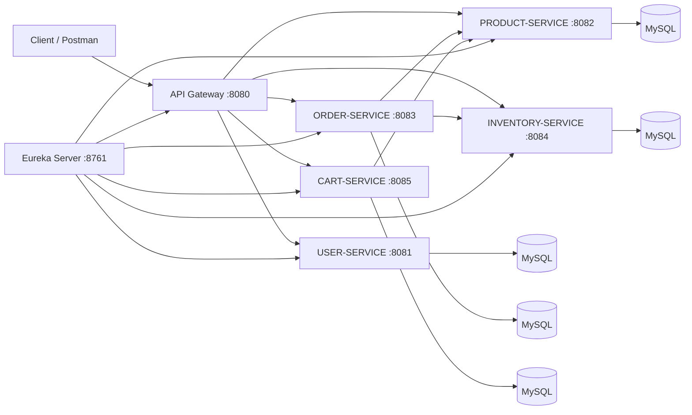
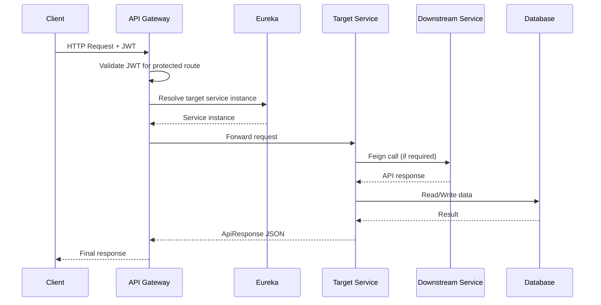

# 🛒 E-Commerce Backend Microservices


A Java Spring Boot microservices-based ecommerce backend that implements service discovery, centralized API routing, JWT-based authentication, product management, inventory management, order processing, and cart management.

The main objective of this project is to build a modular ecommerce backend where each business capability is isolated into its own service and exposed through a single API Gateway.

## 📌 Project Overview

This project solves the problem of building a scalable ecommerce backend by separating authentication, catalog, inventory, ordering, and cart logic into independently deployable services. A microservices approach was chosen because the implementation uses Eureka for discovery, API Gateway for request routing, and OpenFeign for inter-service calls between business services.

At the current stage, the implementation includes user login and registration, JWT handling through the gateway, product APIs, inventory APIs, order APIs, and cart APIs. Payment service, notification service, Swagger/OpenAPI, caching, messaging, and Docker Compose are not confirmed in the provided implementation and are therefore marked as not implemented yet.

## 🧰 Technologies Used

| Category | Technologies |
|---|---|
| Backend | Java, Spring Boot, Spring Web, Spring Data JPA  |
| Security | Spring Security, JWT authentication via API Gateway  |
| Microservices | Spring Cloud Gateway, Netflix Eureka, OpenFeign, Spring Cloud LoadBalancer  |
| Database | MySQL, Hibernate ORM, HikariCP  |
| Build Tools | Maven  |
| Validation | Jakarta Validation  |
| Logging | SLF4J, Logback  |
| Testing | Not implemented yet in the provided materials  |
| Documentation | Markdown README, API response wrappers in codebase  |
| Containerization | Not implemented yet in the provided materials  |
| Messaging Queue | Not implemented yet in the provided materials  |
| Caching | Default Spring Cloud LoadBalancer cache observed; dedicated caching not implemented yet  |
| Cloud | Service discovery through Eureka; cloud deployment config not confirmed |

## 🏗️ Architecture

The implementation uses a gateway-centric microservices architecture where clients call the API Gateway, the gateway validates JWT for protected routes, and the gateway forwards requests to downstream services registered in Eureka. Business services also communicate with each other using OpenFeign and service discovery rather than fixed host URLs.

### Existing services

| Service | Responsibility |
|---|---|
| API Gateway | Central entry point, route forwarding, JWT validation, protected/public API handling. |
| Eureka Discovery Server | Registers and discovers all backend services. |
| User Service | User registration and login, JWT token issuance support, user persistence. |
| Product Service | Product creation, update, retrieval, category filtering, and delete operation. |
| Inventory Service | Inventory creation, stock increase, stock reduction, and stock availability checks. |
| Order Service | Order placement, fetch by id, fetch by user, cancellation, and order listing. |
| Cart Service | Add to cart, fetch cart, update quantity, remove item, and clear cart. |
| Payment Service | Not implemented yet.  |
| Notification Service | Not implemented yet.  |

### Mermaid architecture diagram



## 📁 Folder Structure

The full repository tree was not fully accessible as raw files in the workspace, but the confirmed project structure across services follows this microservice layout pattern from the implementation you shared.

```text
ecommerce-microservices/
├── api-gateway/
├── eureka-server/
├── user-service/
├── product-service/
├── inventory-service/
├── order-service/
├── cart-service/
└── README.md
```

A typical confirmed service package structure is:

```text
src/main/java/com/peddannat/ecommerce/
├── controller/
├── dto/
│   ├── request/
│   └── response/
├── entity/
├── exception/
├── external/
├── repository/
├── service/
│   └── impl/
└── *Application.java
```

## ✨ Features

Only features confirmed from the implementation are listed below.

- User registration.
- User login.
- JWT-based authentication through API Gateway.
- API Gateway route-based forwarding.
- Eureka service discovery.
- Product creation.
- Product update.
- Product fetch by id.
- Product listing with pagination and sorting.
- Product filtering by category.
- Product delete endpoint.
- Inventory creation.
- Inventory fetch by product id.
- Inventory stock increment and decrement.
- Inventory availability check.
- Order placement.
- Order fetch by id.
- Order fetch by user id.
- Order cancellation.
- Order listing.
- Cart creation per user through first add operation.
- Cart item add/update/remove operations.
- Cart fetch by user id.
- Cart clear operation.
- Global exception handling in services.
- Request DTO validation using Jakarta Validation.

## 📡 API Documentation

The tables below are based on confirmed controller mappings shared from the implementation.

### User Service

| Method | Endpoint | Description | Auth Required | Example Request | Example Response |
|---|---|---|---|---|---|
| POST | `/api/users/register` | Register a new user | No  | `{"name":"Peddanna","email":"Peddanna@gmail.com","password":"Peddanna123"}`  | Wrapped success response with created user data  |
| POST | `/api/users/login` | Login user and get JWT | No  | `{"email":"Peddanna@gmail.com","password":"Peddanna123"}`  | Wrapped success response with token  |

### Product Service

| Method | Endpoint | Description | Auth Required | Example Request | Example Response |
|---|---|---|---|---|---|
| POST | `/api/products` | Create product | Yes  | `{"name":"Apple iPhone 15","description":"Latest Apple smartphone with A16 chip","price":79999.00,"category":"Electronics","imageUrl":"https://example.com/iphone15.jpg"}`  | `ApiResponse<ProductResponse>`  |
| GET | `/api/products` | Get all products with pagination | Yes  | `/api/products?page=0&size=5&sortBy=id&sortDirection=asc`  | `ApiResponse<Page<ProductResponse>>`  |
| GET | `/api/products/{id}` | Get product by id | Yes  | `/api/products/1`  | `ApiResponse<ProductResponse>`  |
| PUT | `/api/products/{id}` | Update product | Yes  | Product request body  | `ApiResponse<ProductResponse>`  |
| DELETE | `/api/products/{id}` | Delete product | Yes  | `/api/products/1`  | Wrapped success response  |
| GET | `/api/products/category/{category}` | Get products by category | Yes  | `/api/products/category/Electronics`  | `ApiResponse<List<ProductResponse>>`  |

### Inventory Service

| Method | Endpoint | Description | Auth Required | Example Request | Example Response |
|---|---|---|---|---|---|
| POST | `/api/inventory` | Create inventory | Yes  | `{"productId":1,"quantity":100,"reservedQuantity":0}`  | Wrapped inventory response  |
| GET | `/api/inventory/{productId}` | Get inventory by product id | Yes  | `/api/inventory/1`  | Wrapped inventory response  |
| PUT | `/api/inventory/{productId}/add?qty=50` | Add stock | Yes  | Query param `qty`  | Wrapped inventory response  |
| PUT | `/api/inventory/{productId}/reduce?qty=20` | Reduce stock | Yes  | Query param `qty`  | Wrapped inventory response  |
| GET | `/api/inventory/check/{productId}?qty=10` | Check stock availability | Yes  | Query param `qty`  | Wrapped boolean response  |

### Order Service

| Method | Endpoint | Description | Auth Required | Example Request | Example Response |
|---|---|---|---|---|---|
| POST | `/api/orders` | Place order | Yes  | `{"userId":1,"items":[{"productId":1,"quantity":2}]}`  | Wrapped order response  |
| GET | `/api/orders/{id}` | Get order by id | Yes  | `/api/orders/1`  | Wrapped order response  |
| GET | `/api/orders/user/{userId}` | Get orders by user | Yes  | `/api/orders/user/1`  | Wrapped list response  |
| PUT | `/api/orders/{id}/cancel` | Cancel order | Yes  | `/api/orders/1/cancel`  | Wrapped order response  |
| GET | `/api/orders` | Get all orders | Yes  | `/api/orders`  | Wrapped list/page response as implemented  |

### Cart Service

| Method | Endpoint | Description | Auth Required | Example Request | Example Response |
|---|---|---|---|---|---|
| POST | `/api/cart/{userId}/items` | Add item to cart | Yes  | `{"productId":1,"quantity":2}`  | Wrapped cart response  |
| GET | `/api/cart/{userId}` | Get cart by user id | Yes  | `/api/cart/1`  | `ApiResponse<CartResponse>`  |
| PUT | `/api/cart/{userId}/items/{productId}` | Update cart item quantity | Yes  | `{"quantity":5}`  | Wrapped cart response  |
| DELETE | `/api/cart/{userId}/items/{productId}` | Remove item from cart | Yes  | `/api/cart/1/items/1`  | Wrapped cart response  |
| DELETE | `/api/cart/{userId}` | Clear all cart items | Yes  | `/api/cart/1`  | Wrapped success response  |

## 🗄️ Database Design

The following entities are confirmed from the shared implementation.

| Entity | Fields | Primary Key | Foreign Keys | Relationships |
|---|---|---|---|---|
| User | `id`, `name`, `email`, `password`, `role`, `createdAt` inferred from logs and login flow  | `id` | None confirmed  | Standalone user entity  |
| Product | `id`, `name`, `description`, `price`, `category`, `imageUrl`, `active`, `createdAt`, `updatedAt`  | `id`  | None confirmed  | Referenced by cart and order services through service calls, not JPA relations  |
| Inventory | `id`, `productId`, `quantity`, `reservedQuantity`, `availableQuantity`, `lastUpdated`  | `id`  | No JPA FK confirmed  | Linked logically to product by `productId`  |
| Order | `id`, `userId`, `totalAmount`, `status`, `orderDate`, `items` [1] | `id`  | None confirmed  | One order contains multiple order items  |
| Cart | `id`, `userId`, `items`, `createdAt`, `updatedAt`  | `id`  | None  | One cart has many cart items  |
| CartItem | `id`, `cart`, `productId`, `productName`, `price`, `imageUrl`, `quantity`  | `id`  | `cart_id`  | Many-to-one with `Cart`  |

### Schema notes

The project uses service-level database separation rather than direct entity relationships across services, so product, inventory, order, and cart link through IDs and service calls instead of cross-service foreign keys. Cart-service specifically enforces one cart per user and a unique cart item per `cart_id + product_id` in the corrected implementation shared during development.

## 🔐 Security

JWT authentication is implemented at the API Gateway layer, and downstream protected APIs are accessed through Bearer tokens sent in the `Authorization` header. User registration and login are public APIs, while product, inventory, order, and cart APIs are expected to be protected by the gateway security rules.

The implementation uses Spring Security and BCrypt is present in the runtime stack, although an earlier runtime log also showed a password-format problem during login testing, which indicates password encoding consistency is important in the current setup. The JWT secret exists in configuration, but secrets should never be committed in public repositories and should be replaced with environment-based placeholders in documentation.

### Public APIs

- `/api/users/register` 
- `/api/users/login` 

### Protected APIs

- `/api/products/**` 
- `/api/inventory/**` 
- `/api/orders/**` 
- `/api/cart/**` 

## 🔗 Service Communication

Service-to-service communication uses OpenFeign clients with Eureka-based discovery and client-side load balancing rather than hardcoded downstream URLs. Order-service calls inventory-service and product-service, while cart-service calls product-service to validate and enrich cart items.

Gateway routing is configured with uppercase service IDs such as `USER-SERVICE`, `PRODUCT-SERVICE`, `ORDER-SERVICE`, `INVENTORY-SERVICE`, and `CART-SERVICE`, which aligns with the Eureka registration strategy used in the project.

## ⚠️ Error Handling

The services use centralized exception handling through `@RestControllerAdvice` and custom exception classes such as `ResourceNotFoundException` in the code you shared. Validation failures are handled through Jakarta Validation annotations, and error responses are wrapped in a common API response structure rather than raw framework exceptions.

Typical HTTP status patterns confirmed in the implementation and testing flow include `400 Bad Request`, `401 Unauthorized`, `404 Not Found`, `409 Conflict`, `502 Bad Gateway` for downstream failures, and `500 Internal Server Error` for unhandled conditions.

### API response structure

```json
{
  "success": true,
  "message": "Operation completed successfully",
  "data": {},
  "timestamp": "2026-07-02T18:30:00"
}
```

The timestamp field is confirmed in shared response wrapper implementations for cart and product related services.

## ⚙️ Configuration

The project uses `application.yml` files for service names, ports, Eureka registration, database settings, gateway routes, and JWT configuration. The following runtime ports and names are confirmed from the implementation you shared.[1]

| Component | Service Name | Port |
|---|---|---|
| Eureka Server | Not explicitly named in provided code | `8761`  |
| API Gateway | `API-GATEWAY`  | `8080`  |
| User Service | `USER-SERVICE` | `8081`  |
| Product Service | `PRODUCT-SERVICE`  | `8082`  |
| Order Service | `ORDER-SERVICE` | `8083` |
| Inventory Service | `INVENTORY-SERVICE`  | `8084`  |
| Cart Service | `CART-SERVICE`  | `8085`  |

### Secret handling

- JWT secret: `<JWT_SECRET>` 
- Database username: `<DB_USERNAME>` 
- Database password: `<DB_PASSWORD>` 

Profiles and environment-specific configuration are not confirmed in the provided materials.

## 🛠️ Installation

### Prerequisites

- Java 21 or later is recommended based on the confirmed runtime, although some logs also show Java 25 in use during development.
- Maven installed locally.
- MySQL server running.
- Git installed.

### Setup steps

1. Clone the repository.
2. Create MySQL databases for each service as required by the service `application.yml` files.
3. Update database username and password in each service config using local environment values.
4. Configure JWT secret in API Gateway using a secure local value.
5. Build each service using Maven.

Example build command:

```bash
mvn clean install
```

## ▶️ Running the Project

Use the actual startup order confirmed during testing and integration.

1. Start Eureka Server on `http://localhost:8761`. 
2. Start API Gateway on `http://localhost:8080`. 
3. Start User Service on port `8081`. 
4. Start Product Service on port `8082`. 
5. Start Inventory Service on port `8084`. 
6. Start Order Service on port `8083`. 
7. Start Cart Service on port `8085`. 
8. Open Eureka dashboard and verify all services are `UP`. 
9. Use Postman to register, login, obtain JWT, and test protected endpoints through the gateway. 

## 🐳 Docker

Dockerfiles, Docker Compose files, container networks, and volumes are not confirmed in the provided project materials.[1] This section is therefore **not implemented yet**.

## 🔄 API Flow

A typical request flow in the current implementation is client to gateway, gateway authentication, Eureka-based routing, target service execution, optional Feign call to another service, database interaction, and wrapped JSON response back to the client.



## 🚀 Future Enhancements

These improvements are realistic next steps based on the current implementation state.

- Integrate cart checkout directly with order-service.
- Add payment-service for transaction handling.
- Add notification-service for order status updates.
- Add Swagger/OpenAPI documentation if not already present externally.
- Add Dockerfiles and Docker Compose for one-command startup.
- Move secrets to environment variables or a config server.
- Add unit and integration tests across services.
- Add distributed tracing and centralized logging.
- Add circuit breakers and retry policies for Feign clients.

## 🌟 Project Highlights

This project demonstrates strong backend engineering skills through a practical microservices architecture with independent services, centralized gateway security, Eureka-based discovery, Feign-based communication, layered Spring Boot design, DTO-driven APIs, validation, and exception handling. It also reflects production-style concerns such as route centralization, service isolation, response standardization, and inter-service contracts, even though some production hardening items such as Docker, observability, and externalized secrets are still pending.
